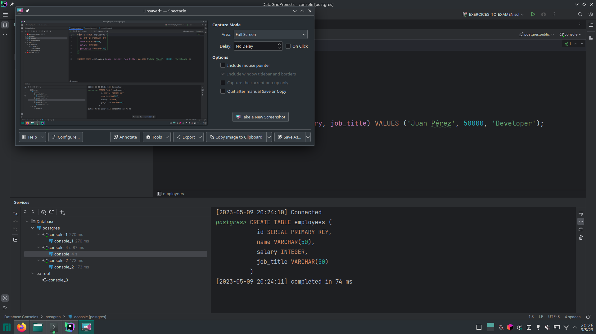
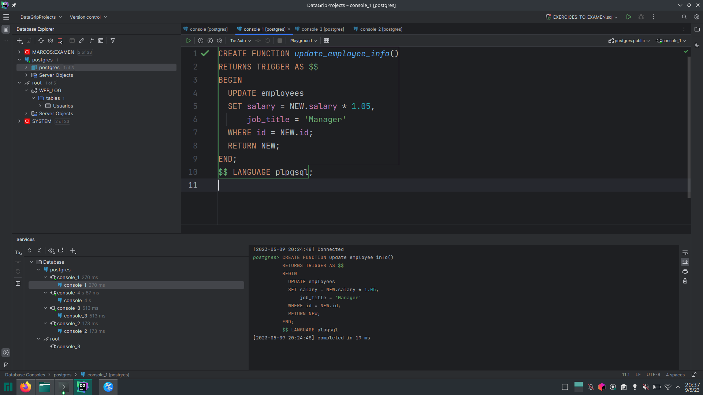
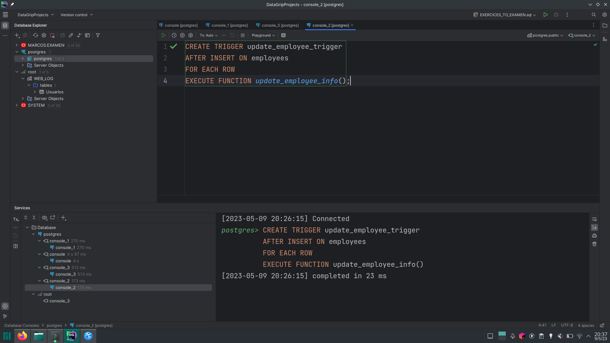
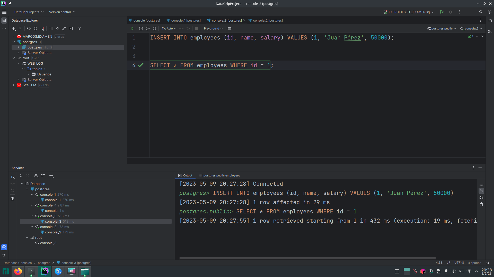
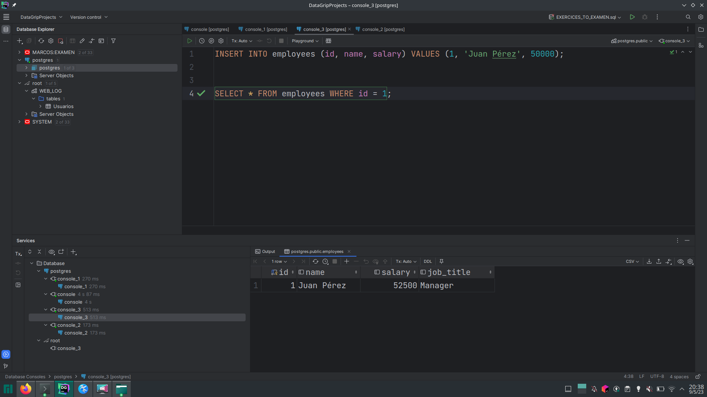
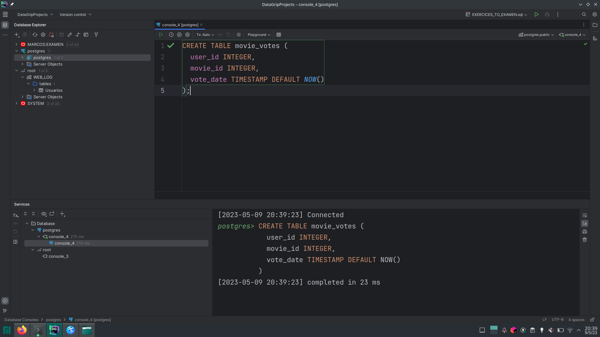
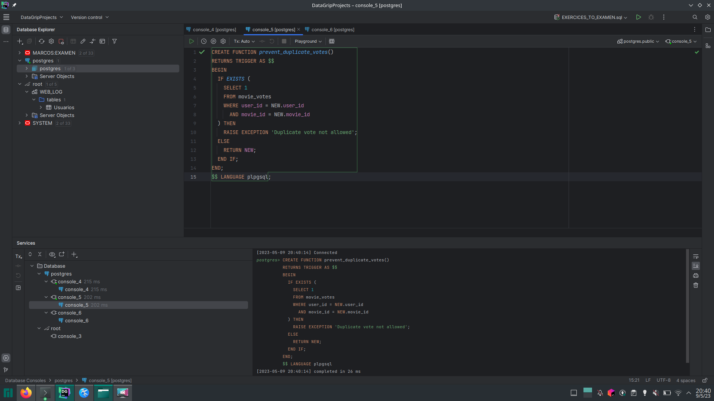
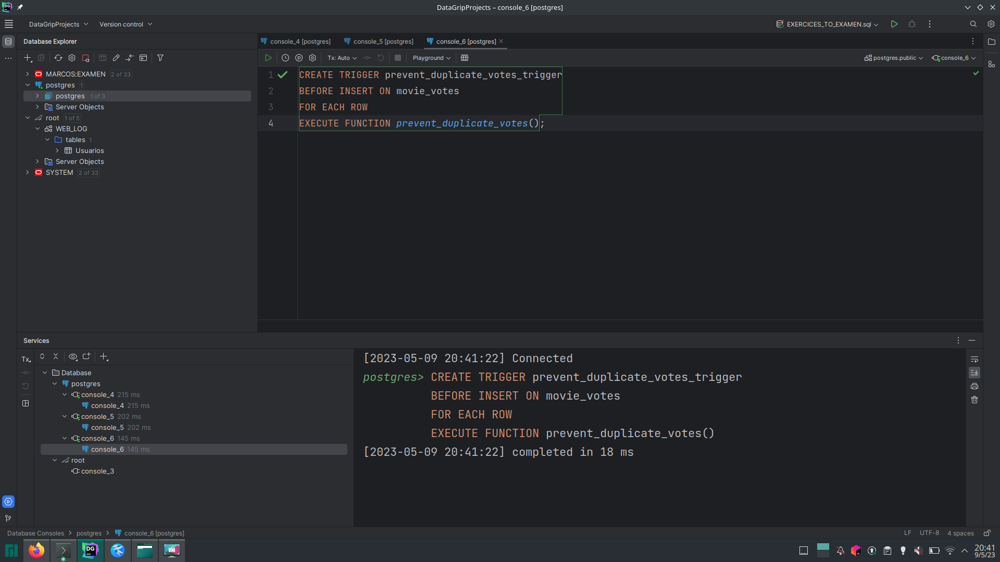
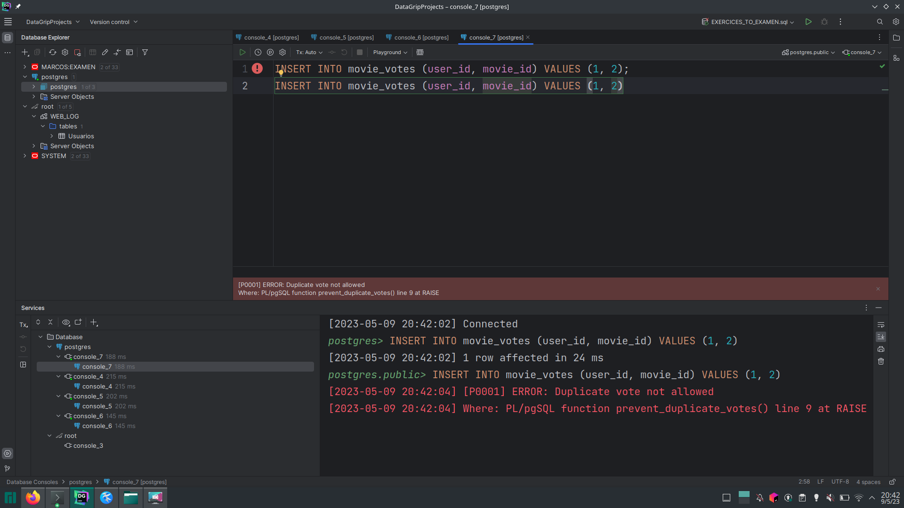

# Siguiendo los pasos


## Creando la tabla facilitada en el repositorio:



## Creando la funcion que ejecutara nuestro trigger:



## Creando nuestro trigger




## Ejecutando el insert




## Comprobamos que funcione




```Efectivamente funciona , el salario ha sido aumentado.... ```


# Ejercicio 2

## Creamos la tabla sobre la que trabajaremos



## Creamos la funcion que implementaremos en nuestro trigger



## Creamos nuestro trigger



## Insertamos un voto dos veces y vemos que nos funciona:


